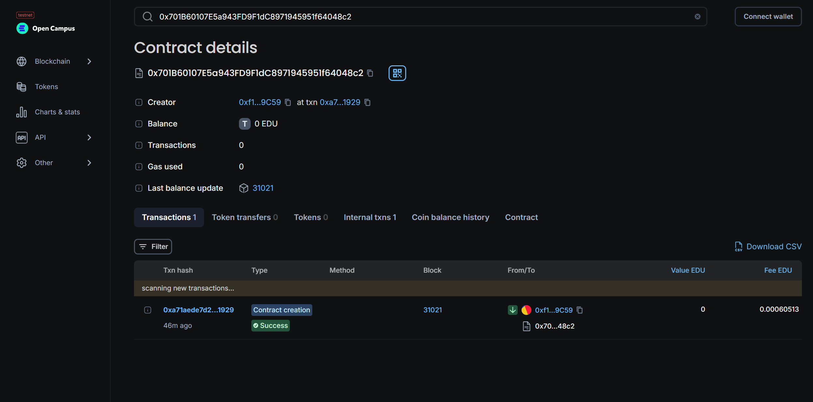

# EduPlay: Blockchain-based Educational Incentive Platform

## Vision


EduPlay is a blockchain-powered educational platform designed to revolutionize the way students engage with their academic responsibilities. By incentivizing timely and accurate assignment submissions with blockchain tokens, EduPlay encourages students to excel in their studies. These tokens can then be utilized in an integrated gaming platform, enhancing the learning experience by blending education with entertainment.

## Flowchart

```plaintext
+--------------------+           +------------------+           +------------------+
|                    |           |                  |           |                  |
|  Student submits   +---------->+  Admin grades    +---------->+  Tokens awarded  |
|  assignment        |           |  assignment      |           |  to student      |
|                    |           |                  |           |                  |
+--------------------+           +------------------+           +------------------+
        |                               |                                |
        v                               v                                v
+--------------------+           +------------------+           +------------------+
|                    |           |                  |           |                  |
|  Assignment stored |           |  Tokens can be    +---------->+  Tokens spent    |
|  with timestamp    |           |  used in games   |           |  on gaming       |
|                    |           |                  |           |  platform        |
+--------------------+           +------------------+           +------------------+
```

## Smart Contracts

### 1. `EduToken.sol`
This contract manages the creation and distribution of `EduToken` (EDU). It allows the admin to mint tokens as rewards for students based on their assignment performance.

- **Contract Address**: 0x46C73Cf69a64D5916aec09940475826094929929
- **Functions**:
  - `mint(address to, uint256 amount)`
  - `burn(address from, uint256 amount)`


### 2. `AssignmentSubmission.sol`
This contract handles the submission and grading of assignments. It interacts with `EduToken` to reward students for timely and accurate submissions.

- **Contract Address**: 0x0344365e28445a1FAA4247C809765f23FF5B269D
- **Functions**:
  - `submitAssignment(uint256 assignmentId)`
  - `gradeAssignment(address student, uint256 assignmentId, uint256 grade)`
  - `calculateReward(uint256 grade, uint256 timeTaken)`
  - `setRewardRate(uint256 newRate)`


### 3. `Game_Platform.sol`
This contract allows students to spend their earned tokens within a gaming platform, further incentivizing academic excellence.

- **Contract Address**: 0x701B60107E5a943FD9F1dC8971945951f64048c2
- **Functions**:
  - `spendTokens(uint256 amount)`
  - `setAdmin(address newAdmin)`



## Future Scope

EduPlay aims to expand its ecosystem by integrating additional educational modules, such as quizzes and interactive learning sessions, that also reward students with tokens. We plan to enhance the gaming platform with more features, offering students a wider range of ways to utilize their tokens. Integration with other blockchain-based educational tools and platforms is also on the roadmap, creating a comprehensive and engaging learning environment.

## Contact

For inquiries, collaboration opportunities, or support, please contact us at:

- **Name**: Ranbir Chowdhury
- **Email**: ranbirchowdhury2003@gmail.com
- **LinkedIn**: https://www.linkedin.com/in/ranbir-chowdhury
- **Twitter**: https://x.com/ranbirs_tweet

We are excited to see how EduPlay can help make learning more fun and rewarding for students everywhere!


This README provides a clear overview of our project, including its vision, workflow, contract details, and future goals.